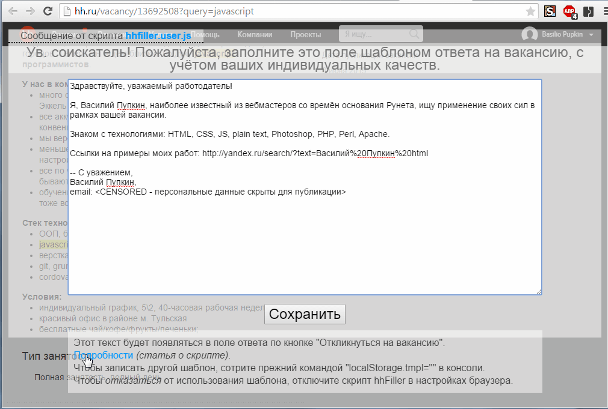
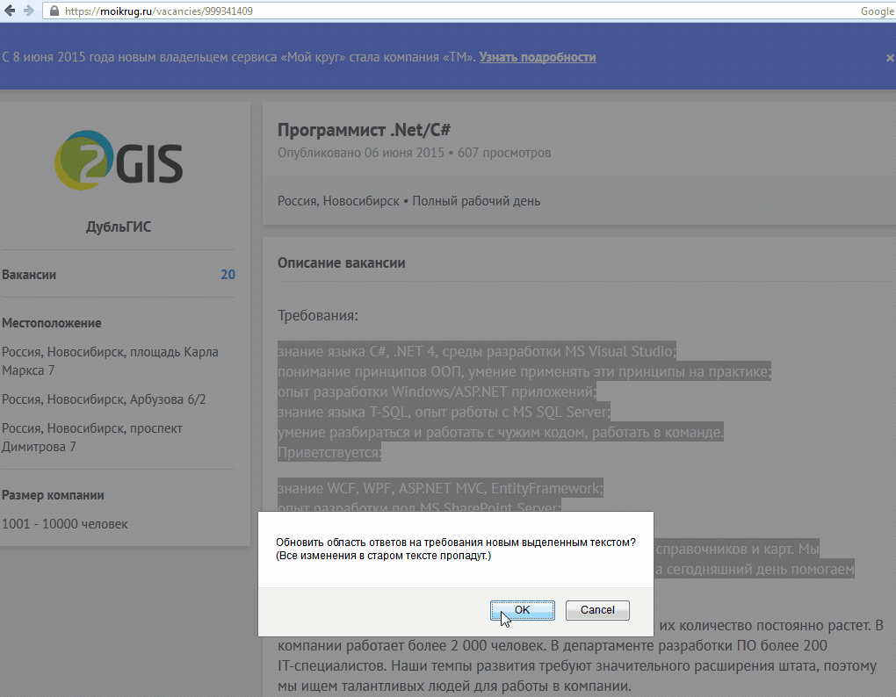

#### [hhFiller](https://greasyfork.org/ru/scripts/10338-hhfiller) - юзерскрипт для вставки шаблона письма ответа на вакансию, работающий на [Headhunter](http://hh.ru), [career.ru](http://career.ru) (дочерний от Hh с теми же аккаунтами), [moikrug](http://moikrug.ru)

* Шаблон вначале предлагается через попап с полем ввода ввести в память браузера при первом заходе на каждый обслуживаемый сайт (рис.1). Его же можно внести непосредственно в код скрипта в поле letterTmpl.

* Скрипт добавляет выделенный текст в конец письма как ответ на требования по вакансии, с добавлением слов "да" в конце каждой строки, для дальнейшего ручного форматирования (рис.2). Выделение можно сменять "на лету", стирая выбранную ранее часть письма.

* Обновление шаблона при очистке поля ввода.
* подсветка отвеченных вакансий в списке на hh; подавление некоторых баннеров.
* сохранение выделенного пользователем (обычно - требования по вакансии) при переходе на "страницу тестов" и обычная вставка этого текста после тестов в поле ввода.

* Устанавливается во всех браузерах. Для Хрома - поместить рядом со скриптом файл manifest.json с содержанием
```
{
   "content_scripts": [ {
      "exclude_globs": [  ],
      "exclude_matches": [  ],
      "include_globs": [
		  "http://hh.ru/*", "http://career.ru/*", "https://moikrug.ru/*"  ],
      "js": [ "hhfiller.user.js" ],
      "matches": [ "http://*/*", "https://*/*" ],
      "run_at": "document_idle"
   } ],
   "converted_from_user_script": true,
   "description": "Заполнить отклик на вакансию на hh.ru/career.ru/moikrug.ru с помощью шаблона",
   "name": "hhFiller",
   "version": "6.2016.1.12",
   "manifest_version": 2
}
```
и устанавливать как "распакованное расширение" в режиме разработчика (chrome://extensions/).

* Изменять шаблон - удалением прежнего командой "localStorage.tmpl ='';" из консоли браузера (открывается по F12).

* Статья про скрипт: [Свой шаблон отклика-письма на HeadHunter (и moikrug) без Copy-Paste](http://habrahabr.ru/post/259881/)

* Github: https://github.com/spmbt/hhFiller

* Скриншоты:
    * 
    * 
    * 

* Обновления
    * 21.12.2015: обновлены пути для сайта hh.ru - восстановлена работа заполнения;
    * 24.12.2015: добавлен career.ru - всё, как на Hh, даже аккаунты те же;
    * 12.01.2016: добавлен career.ru - hh/career: чистка некоторых баннеров, сохранение выделенного для отклика при проходе "страницы тестов";

============[en]==============

Fill response post for vacation in hh.ru and moikrug.ru by template (russian headhunter sites).

* Insert template (fig.1)
* Add selected text to end of letter and formatting it (fig.2)
* Refresh template if clear input area
* Crossbrowser design. For Chrome it need for manifest.json
* For editing of template remove previous one by command "localStorage.tmpl ='';" in console (opened by F12).
* Article (ru) about it: [Own template of response letter in HeadHunter.ru (and moikrug.ru) w/o Copy-Paste](http://habrahabr.ru/post/259881/)
* Github: https://github.com/spmbt/hhFiller